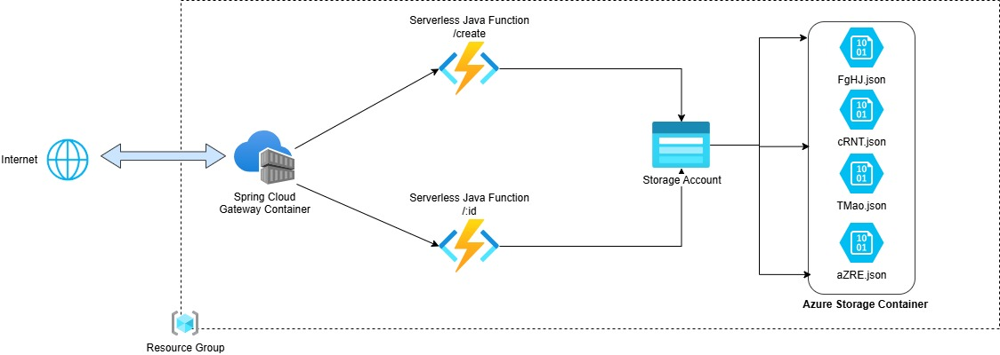

<h1 align="center">
    URL Shortener Backend
</h1>
<h3 align="center">
    Java + Azure + Spring Cloud Gateway
</h3>

## 🧭 Visão Geral

Este projeto é um **encurtador de URLs**, construído com Java e infraestrutura serverless da Azure. Ele permite criar links curtos com expiração e redirecionar usuários de forma segura e eficiente — tudo armazenado em **Azure Blob Storage**.

---

## 🏗️ Arquitetura

<p align="center">
    
</p>

| Componente               | Tecnologia             | Tipo de Implantação     |
|--------------------------|------------------------|--------------------------|
| **API Gateway**          | Spring Cloud Gateway   | Docker (ACI via ACR)     |
| **Criação de URL**       | Azure Function (Java)  | Serverless               |
| **Redirecionamento**     | Azure Function (Java)  | Serverless               |
| **Armazenamento**        | Azure Blob Storage     | Serverless (Blob JSON)   |

> 🌐 **Endpoint do Gateway (temporariamente offline):**  
> `http://scg-encurtador.brazilsouth.azurecontainer.io`

---

## 🚀 Como Usar

### 1️⃣ Criar uma URL Encurtada

**Endpoint:** `POST /create`

**Body:**
```json
{
  "url": "https://exemplo.com  ",
  "expiresIn": 3600
}
```

| Campo       | Descrição                             | Validação                     |
|-------------|---------------------------------------|-------------------------------|
| `url`       | URL de destino                        | Não nula, não vazia, formato URL |
| `expiresIn` | Tempo de vida em **segundos**         | Inteiro positivo              |

**Resposta (201 Created):**
```json
{
  "sourceURL": "https://example.com  ",
  "destinyUrl": "WXYZ",
  "expiresDate": "2025-02-08T00:00:00.0000"
}
```

<p align="center">
    
</p>

---

### 2️⃣ Redirecionar Usuário

**Endpoint:** `GET /{destinyUrl}`

**Exemplo:**
```
GET http://scg-encurtador.brazilsouth.azurecontainer.io/abc123
```

✅ Se válida → Redireciona para URL original (301) 

❌ Se expirada → Retorna erro JSON com mensagem de erro

> 🖥️ **No navegador:** Redirecionamento automático  
> 🧪 **Via client HTTP:** Recebe o HTML da página de destino

<p align="center">
    
</p>

---

## 💾 Armazenamento no Azure Blob Storage

Cada URL encurtada gera um **arquivo `.json`** no Blob Storage com a estrutura:

```json
{
  "sourceURL": "https://example.com",
  "destinyUrl": "ABCD",
  "expiresDate": "2025-02-08T00:00:00"
}
```

📁 **Container padrão:** `url-temp-file`  
🔑 **Nome do blob:** `{destinyUrl}.json`

---

## 🔍 Validação de Entrada

A classe `RequestDTO` garante a integridade dos dados recebidos:

```java
@Getter
@Setter
public class RequestDTO {
    @NotNull
    @NotBlank
    @URL
    private String url;

    @NotNull
    @Positive
    private int expiresIn;
}
```

✅ Validações automáticas via anotações Jakarta Bean Validation.

---

## 🐳 Implantação do API Gateway (Spring Cloud Gateway)

### Passo a passo para publicar no Azure Container Registry (ACR)

| Etapa | Comando |
|-------|---------|
| 1. Build da imagem | `docker build -t url-shortener-gateway .` |
| 2. Tag para ACR | `docker tag url-shortener-gateway:latest <NOME_ACR>.azurecr.io/url-shortener-gateway:latest` |
| 3. Push para ACR | `docker push <NOME_ACR>.azurecr.io/url-shortener-gateway:latest` |
| 4. Deploy no ACI | `az container create --resource-group <RG> --name gateway --image <NOME_ACR>.azurecr.io/url-shortener-gateway:latest --cpu 1 --memory 1 --registry-login-server <NOME_ACR>.azurecr.io --dns-name-label scg-encurtador --os-type Linux --ports 80` |

> ⚙️ Substitua `<NOME_ACR>` e `<RG>` pelos valores reais do seu ambiente Azure.
